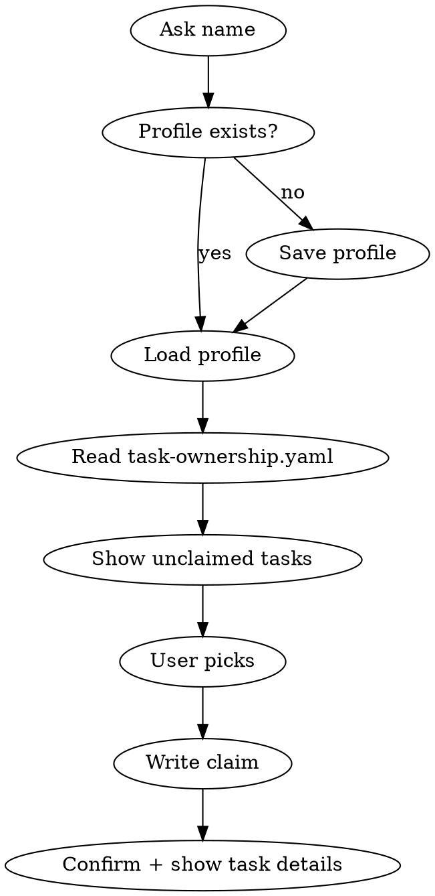

# tasks-for-mushrooms

Project-specific task guide for group4-data-for-all. Prevents collision by claiming tasks in a shared YAML before anyone starts work.

## Files

- Tasks: `session-3/tasks.md`
- Ownership: `session-3/task-ownership.yaml`
- Profiles: `session-3/profiles/[name].yaml`

## Flow



## Step 1 — Name

Ask: **"What's your name?"**

Check `session-3/profiles/[name].yaml`:
- Exists → load it, skip to Step 3
- Missing → save a minimal profile, continue

Profile format:
```yaml
name: Dominika
joined: 2026-05-13
```

## Step 2 — Read ownership

Read `session-3/task-ownership.yaml`.

A task is **available** if it has no `owner` field (commented out).
A task is **yours** if `owner` matches the user's name — show it first regardless of status.

## Step 3 — Show tasks

**If the user has a pre-claimed task** (D-DOMINIKA or D-JUAN):
- Lead with: "You already own **[task ID]** — [one-line description]. Want to pick an additional task or just focus on that one?"

**Available tasks** (no owner): show as a clean list with one-line descriptions. Group by track (PROCESS / DOCS). Do not show tasks owned by others.

Reference for one-liners:

| ID | One-liner |
|----|-----------|
| P1 | Retrofit notebook 02 — add before/after prints and design decision cells |
| P2 | Retrofit notebook 03 — document scoring weights and bounds |
| P3 | Retrofit notebook 04 — connectivity thresholds and edge counts |
| P4 | Retrofit notebook 05 — data provenance and colour scale docs |
| P5 | New validation notebook — assert all columns are in range |
| DO1 | Write the Session 3 README following the course template |
| DO2 | Restructure data-quality-audit.md with CRISP-DM framing |

If all tasks are claimed: "Everything's claimed. Talk to Rafik if you need a task released."

## Step 4 — Claim

When they pick a task, immediately write to `session-3/task-ownership.yaml`:

```yaml
P2:
  owner: Dominika
  claimed: 2026-05-13
  status: claimed
```

Confirm: **"[ID] is yours. No one else will touch it. Here's what to do:"**
Then print the full task description from `session-3/tasks.md`.

## Rules

- Never show tasks owned by someone else
- Never unclaim a task — only Rafik can do that
- Never run the name question twice — profile is permanent
- If a task has been claimed for 7+ days with no status update, flag it as stale but still don't unclaim it
- Always end with the full task description so they can start immediately
