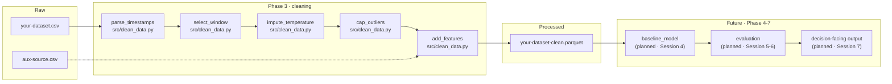

# Pipeline Architecture v1

> **What this is:** the system sketch from Session 2, evolved with **real
> boxes** now that cleaning is real code.
>
> Save as `docs/pipeline-architecture-v1.md` in your repo. Replaces the
> high-level `system-sketch-v0.md` as the source of truth.

---

## What changed since v0

In Session 2 your system sketch had aspirational boxes — "spatial join",
"strategy ranking", "user output". Today, your **cleaning** boxes are no
longer aspirational. They have file paths, function names, and contracts.

This file captures that transition. Boxes that are **implemented** get
file paths. Boxes that are **planned** get explicit "(planned — Session N)"
labels. No mixing.

---

## The diagram

> Replace this with your actual pipeline. The pattern: every
> implemented box has a file path; every planned box says "(planned ·
> Session N)".

---

## Components — implemented (Phase 3)

For each implemented box, fill in:

### `parse_timestamps` *(example — replace with yours)*

- **File:** `src/clean_data.py`
- **Input contract:** `pd.DataFrame` with a `timestamp` string column
- **Output contract:** Same dataframe + `timestamp` parsed to UTC datetime + `timestamp_raw` preserved
- **Failure mode:** Raises `ValueError` if >1% of timestamps fail to parse
- **Tests / assertions:** `assert df['timestamp'].notna().all()` runs in `assert_clean_invariants`
- **Cleaning log entry:** [Transform 1 in `data-cleaning-log.md`]

### `[your transform 2]`

- **File:** 
- **Input contract:** 
- **Output contract:** 
- **Failure mode:** 
- **Tests / assertions:** 
- **Cleaning log entry:** 

*(continue for every implemented box)*

---

## Components — planned (Phase 4–7)

For each planned box, **only** name it and say which session it lands in.
Don't try to design ahead of the phase.

| Component | Lands in | One-line role |
|---|---|---|
| Baseline model | Session 4 | Predicts [target] from cleaned features |
| Synthetic data augmentation | Session 5 | Fills underrepresented [scenario] |
| Failure gallery | Session 6 | Documents 5+ cases the system gets wrong |
| Decision-facing output | Session 7 | [Form: dashboard / report / notebook tool] for [user] |

---

## The contracts

The seam between Phase 3 and Phase 4 — between "cleaned data" and "model"
— is the **schema of the parquet file**. Document it.

### `data/processed/<dataset>-clean.parquet` schema

| Column | Type | Units | Source | Allowed range | Description |
|---|---|---|---|---|---|
| `timestamp` | `datetime64[ns, UTC]` | UTC | parsed from raw | 2023-06-01 to 2023-09-30 | Parsed timestamp |
| `station_id` | `object` | — | raw | — | Station identifier |
| `temp_c` | `float64` | °C | raw + imputed + clipped | [-40, 55] | Cleaned temperature |
| `temp_c_imputed_flag` | `bool` | — | derived | — | True if value imputed |
| `temp_c_clipped_flag` | `bool` | — | derived | — | True if value was clipped |
| `hour_of_day` | `int8` | hour | derived | [0, 23] | From timestamp |
| `month` | `int8` | month | derived | [1, 12] | From timestamp |
| `is_summer` | `bool` | — | derived | — | June–August |
| `temp_anomaly_c_vs_station_median` | `float64` | °C | derived | — | Difference from station median |

> Replace with your actual schema. Every column has a row.

---

## Open seams

> Where does the architecture have weak links? Document them honestly so
> Sessions 4–7 know where to expect breakage.

- **Seam 1:** [...]
  - Why it's weak:
  - Mitigation plan:

- **Seam 2:** [...]
  - Why it's weak:
  - Mitigation plan:

- **Seam 3:** [...]
  - Why it's weak:
  - Mitigation plan:

---

## Sign-off

**Drawn by:** [name]
**Last updated:** [YYYY-MM-DD]
**Diagram updated to match `src/clean_data.py`:** [yes / no]
