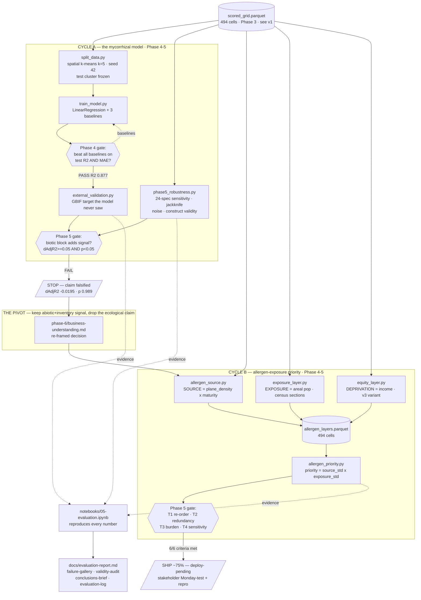

# Pipeline Architecture v3 — Mycorrhizal Barcelona → Allergen Priority

> **Document type:** Architecture decision record (pipeline-level)
> **Status:** ACCEPTED
> **Date:** 2026-06-09
> **Deciders:** Rafik, Claude
> **CRISP-DM Phase:** 5 (Evaluation) — v1 evolved with the **evaluation boxes** and the pivot
> **Supersedes:** `docs/pipeline-architecture-v1.md` (Phase 3). v1 remains the reference for the
> upstream cleaning/scoring components C1–C12 and the `scored_grid` schema — not duplicated here.

## What changed since v1

v1 (Phase 3) drew implemented cleaning/scoring components but ended at `scored_grid` with Phase
4–7 as empty "future" boxes. v3 fills those boxes **and adds the thing v1 had none of:
evaluation gates** — explicit decision diamonds where a result is tested against a pre-registered
criterion and the pipeline either proceeds or stops.

The decisive structural change is that **evaluation killed the original pipeline.** v1's whole
right-hand side (composite → priority map of "barrier severity") was carried into a Phase-4 model
and a Phase-5 external test — and the test **falsified the ecological claim.** v3 therefore has
two cycles:

| | Cycle A (v1 lineage) | Cycle B (the pivot) |
|---|---|---|
| Product | linear model of `composite_score_B` | allergen-exposure priority composite |
| Phase-5 gate | external GBIF test | pre-registered T1–T4 |
| Outcome | **KILL** (partial-F p 0.989) | **SHIP ~75%**, deploy-pending |
| New code | `src/train_model.py`, `src/split_data.py`, `src/external_validation.py`, `src/phase5_robustness.py` | `src/allergen_source.py`, `src/exposure_layer.py`, `src/allergen_priority.py`, `src/equity_layer.py` |

Other changes from v1: the canonical pipeline moved from notebooks to `src/*.py` (notebooks are
narrative); `scored_grid.parquet` is now the source of truth (not `.geojson`); the connectivity
subgraph (v1 N1–N4) is **not used** by either cycle's evaluated product.

---

## The diagram (evaluation boxes are the diamonds)

Legend: rectangles = processing components; **`{{diamonds}}` = evaluation gates**; `/parallelograms/`
= verdicts. The two diamonds that did the real work are `M5A` (killed Cycle A) and `T1234` (passed
Cycle B).

---

## New components — Phase 4 (modeling)

### M1: `split_data.py` — spatial cluster split

| Property | Value |
|---|---|
| **File** | `src/split_data.py` |
| **Operation** | k-means (k=5, seed 42) on cell centroid in EPSG:25831 → train {0,1,2} / eval {3} / test {4} (≈64/19/18%). |
| **Output** | `data/splits/{train,eval,test}.parquet` + `cluster_assignments.parquet`. |
| **Gate semantics** | Test cluster written at split time, inspected **once** at final assessment (Lecture 4 line 313). The sacredness of this set is what makes the Phase-4 number meaningful. |
| **Pre-registration** | `phase-4/test-design.md §1` (written before build). |

### M2: `train_model.py` — interpretable linear model + 3 baselines

| Property | Value |
|---|---|
| **File** | `src/train_model.py` → `outputs/phase-4/model_artifact.joblib`, `predictions.parquet`, `metrics.csv` |
| **Model** | `Pipeline([SimpleImputer(median, fit on train), LinearRegression(fit_intercept=False)])`, 10 raw features, target `composite_score_B`. |
| **Baselines** | BaselineMean, BaselineSpatialNearest, BaselineDomainHeuristic (all fit on train only). |
| **Phase-4 gate (M4)** | beat all three baselines on test R² AND MAE. **Result: PASS** — test R² 0.877 vs −0.29; MAE 0.0106 vs 0.130. |
| **What the gate did NOT test** | whether the *composite is ecologically real* — that is a Phase-5 question, and the reason M4 PASS did not end the story. |

---

## New components — Phase 5 (evaluation gates) · the heart of v3

### E1: `external_validation.py` — the kill gate (M5A)

| Property | Value |
|---|---|
| **File** | `src/external_validation.py` → `outputs/phase-5/external_validation_results.{md,json}` |
| **Operation** | Build an **external** target the pipeline never saw — observed GBIF fungal occurrence per cell — then nested OLS on the 99 observed cells: M0 abiotic null (sealed+ndvi+effort) vs M1 + biotic/host block; partial-F test. |
| **Pre-registered pass** | ΔAdj-R² ≥ 0.05 **and** partial-F p < 0.05 (`phase-5/external-validation-design.md §4`). |
| **Result (the gate fires)** | M0 0.6972 → M1 0.6777, Δ **−0.0195**, partial-F p **0.989** → **FAIL → KILL.** Robust to log-richness (p 0.57), drop-effort (p 0.54); Moran's I −0.047 (p 0.21, not a spatial artifact). |
| **Leakage guard** | inputs checked against composite-defining columns; `prpi`/`s4_mismatch` flagged but used here as predictors of an *external* target the composite never saw — intended, not a violation. |
| **Architectural role** | this single diamond is why the project pivoted. It is the load-bearing evaluation box v1 lacked. |

### E2: `phase5_robustness.py` — model-side ROB/VAL evidence

| Property | Value |
|---|---|
| **File** | `src/phase5_robustness.py` → `outputs/phase-4/{sensitivity-grid.csv,stability.json,construct-validity.json}` |
| **ROB-01..04** | 24-spec sensitivity grid (3 normalizations × 4 weightings × 2 aggregations); cells tagged ROBUST 321 / MODERATE 97 / FRAGILE 76. |
| **ROB-03** | Cronbach's α across 4 sub-scores = 0.599 (weak internal consistency). |
| **ROB-05..08** | jackknife coefficients; noise-injection test-R² 0.876 (Δ −0.0008); alt-seeds 0.877/0.877/0.877; alt-cut 0.878 → model is **stable**. |
| **VAL-01..04** | convergent r(pred, sealed)=0.94; discriminant r(pred, richness)=0.25; Jaccard top-15 pred vs flag 0.36; OOD: no district mean\|resid\|>0.10. |
| **Gate semantics** | feeds M5A by establishing *stability ≠ validity*: the model is stable and is essentially a sealed-surface measure — so the kill is about validity, not noise. |

---

## New components — Cycle B (the pivot product)

### B1: `allergen_source.py` / `exposure_layer.py` / `equity_layer.py` — the layers

| Component | File | Layer | Key construction |
|---|---|---|---|
| SOURCE | `src/allergen_source.py` | pollen emission proxy | `minmax(plane_count × maturity)`, maturity = `1 − trees_young_pct/100` |
| EXPOSURE | `src/exposure_layer.py` | residential receptors | areal-weighted Padró 2026 population (census sections → cells), `minmax` |
| DEPRIVATION (v3) | `src/equity_layer.py` | equity weight | `minmax(max_income − cell_income)`, population-weighted income per cell |

→ all written to `data/processed/allergen_layers.parquet` (494 cells, EPSG:25831).

### B2: `allergen_priority.py` — priority + the Phase-5 gate (T1234)

| Property | Value |
|---|---|
| **File** | `src/allergen_priority.py` → `outputs/phase-6/allergen_priority_results.{md,json}`, `priority_zones.csv` |
| **Product** | `priority = source_std × exposure_std` (v1 efficiency); `× deprivation_std` (v3 equity). Feasibility = `1 − sealed`, annotated, never multiplied in. |
| **Pre-registered gates** | T1 re-order (J15<0.70 & ρ<0.90) → 0.30/0.89 **PASS**; T2 redundancy (both ≥0.3, cross<0.8) → 0.80/0.64/0.30 **PASS**; T3 burden margin>0 → +0.046 **PASS**; T4 sensitivity 3/3 **PASS**. |
| **Verdict** | exposure earns its place → **SHIP ~75%**, deploy-pending (`phase-6/phase-5-audit.md`). |
| **Structural contrast with Cycle A** | two layers that *both* move the ranking (corr 0.30), tested against an unknown-answer question — the deliberate opposite of a single-variable composite validated against its own ingredients. |

### B3: `notebooks/05-evaluation.ipynb` — the reproduction harness

| Property | Value |
|---|---|
| **Role** | restart-runs top-to-bottom and **reproduces every number** in `docs/evaluation-report.md` by re-running the gate logic from frozen artifacts. |
| **Gate semantics** | the reproducibility gate of the whole evaluation: report ≠ notebook ⇒ report is fiction. Verified 2026-06-09 (ALL REPRODUCE). |

---

## Evaluation gates summary (the boxes v1 didn't have)

| Gate | Cycle | Criterion (pre-registered) | Result | Verdict |
|---|---|---|---|---|
| M4 — baseline contest | A | beat 3 baselines on test R² & MAE | 0.877 vs −0.29 | PASS |
| **M5A — external validity** | A | ΔAdj-R² ≥0.05 & p<0.05 | Δ −0.0195, p 0.989 | **FAIL → KILL** |
| T1 — re-order vs density | B | J15<0.70 & ρ<0.90 | 0.30 / 0.89 | PASS |
| T2 — redundancy | B | both ≥0.3; cross<0.8 | 0.80/0.64/0.30 | PASS |
| T3 — burden capture | B | margin>0 @top15 | +0.046 | PASS |
| T4 — sensitivity | B | hold 3/3 | 3/3 | PASS |
| Repro — notebook | both | report == notebook | exact | PASS |

---

## Open seams carried into v3

- **The un-closable one (L1):** SOURCE is a literature-anchored emission proxy; **no measured
  Barcelona pollen series exists** to validate it. Cycle B's central limitation.
- **Residential ≠ daytime exposure (L2):** commuter-heavy axes may rank on non-receptor residents.
- **MAUP (L3):** 400 m grid + areal population; not valid below 400 m.
- **Deployment gates (L4, L5):** independent reproduction and a real stakeholder Monday-test are
  **unperformed by design** — they are the Phase-6 agenda, deferred to class.
- v1's Cycle-A seams (AM graph SANT MARTÍ-only, S4 informationally null, bridge=0, spread
  deprecated) are **moot for the shipped product** — Cycle B uses none of the connectivity/host
  machinery. They remain documented in v1 as the record of why the ecological claim could not hold.

---

## Sign-off

- **Team:** Group 4 (Rafik El Khoury). Drawn by Rafik + Claude (Opus 4.8).
- **Last updated:** 2026-06-09
- **CRISP-DM Phase:** 5 (Evaluation) — analytical evaluation complete; deployment gates open by design.
- **Pipeline source (canonical):** `src/clean_data.py` → `src/split_data.py` → `src/train_model.py`
  → `src/external_validation.py` + `src/phase5_robustness.py` (Cycle A) → pivot →
  `src/allergen_source.py` + `src/exposure_layer.py` + `src/equity_layer.py` →
  `src/allergen_priority.py` (Cycle B). Evidence harness: `notebooks/05-evaluation.ipynb`.
