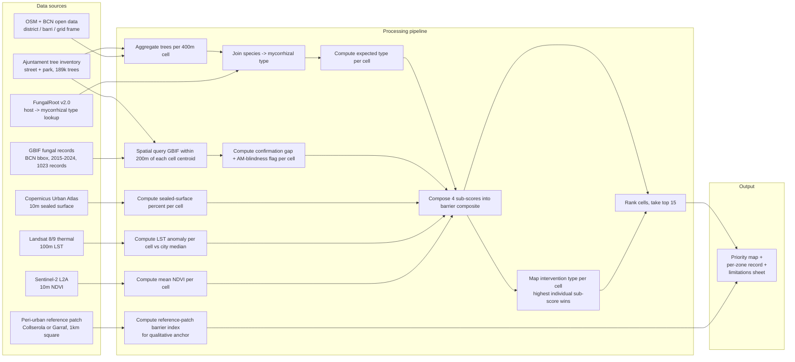

# System Sketch v0

> One-page diagram + descriptions of how data flows from sources to the
> planner's output. Decision unit: Superilla / 400m × 400m grid. Output
> form: a barrier-reduction priority map (see `output-sketch-v0.md` for
> the user-facing detail).

---

## The diagram

> Every box has a verb. Every arrow is a contract — a typed dataset that
> moves from producer to consumer.

---

## Component descriptions

### Sources *(left side — what comes in)*

- **Source A:** Ajuntament BCN tree inventory (street + park combined).
  - Provides: 189,090 trees, location + species, 381 unique species, 10
    districts.
  - Serves: sub-questions 1, 5, 6.
  - Format / cadence: CSV, quarterly snapshots, UTF-8.
  - Datasheet: `docs/datasheets/ajuntament-trees.md`

- **Source B:** GBIF fungal occurrences (BCN bbox, 2015–2024).
  - Provides: ~1,023 records, mostly citizen-sci (HUMAN_OBSERVATION 98%).
  - Serves: sub-question 5 (confirmation context); sub-question 7
    (reference-patch comparison).
  - Format / cadence: Darwin Core Archive via GBIF download (DOI-stamped).
  - Datasheet: `docs/datasheets/gbif-fungi.md`

- **Source C:** FungalRoot v2.0.
  - Provides: ~14,870 plant species → mycorrhizal type mapping (AM, EM,
    mixed, NM).
  - Serves: sub-question 1 (host → expected type join).
  - Format / cadence: static published lookup table.
  - Datasheet: inline citation in `problem-brief.md`.

- **Source D:** Copernicus Urban Atlas 2018 / 2021.
  - Provides: 10m sealed-surface fraction over BCN Functional Urban Area.
  - Serves: sub-question 2 (sealed-surface input → de-paving leverage).
  - Format / cadence: vector + raster, 3-yearly vintages.

- **Source E:** Sentinel-2 L2A.
  - Provides: 10m surface reflectance, NDVI / EVI computable.
  - Serves: sub-question 4 (canopy / NDVI sub-score).
  - Format / cadence: scene tiles, 5-day revisit.

- **Source F:** Landsat 8/9 thermal.
  - Provides: 100m LST.
  - Serves: sub-question 3 (heat anomaly sub-score).
  - Format / cadence: scene tiles, ~8-day combined revisit.

- **Source G:** OSM + BCN open data.
  - Provides: district + barri boundaries, 400m grid framework, street
    network, building footprints.
  - Serves: spatial framework throughout.

- **Source H:** Peri-urban reference patch (Collserola or Garraf, ~1km²).
  - Provides: a methodological anchor — same data layers (sources B + D
    + E + F) applied to a less-stressed habitat patch.
  - Serves: sub-question 7 (reference baseline for the urban core).

### Processing *(middle — what happens)*

- **P1 — Aggregate trees per 400m cell.**
  - **Input:** Source A (tree inventory) + Source G (400m grid).
  - **Output:** per-cell tree list (codi, species, lat/lon, district).
  - **Transformation:** spatial join trees → grid cells; reproject to
    ETRS89 / UTM 31N for distance calculations.

- **P2 — Join species → mycorrhizal type.**
  - **Input:** P1 output + Source C (FungalRoot).
  - **Output:** per-tree mycorrhizal type label (AM / EM / mixed / NM /
    unknown).
  - **Transformation:** species-level lookup with genus-level fallback for
    the 25 *Washingtonia sp* records.

- **P3 — Compute expected type per cell.**
  - **Input:** P2 output.
  - **Output:** per-cell categorical (e.g. "AM-dominant ≥80%",
    "mixed", "EM-dominant", "no host").
  - **Transformation:** per-cell modal type + composition fractions.

- **P4 — Spatial query GBIF within 200m of each cell centroid.**
  - **Input:** Source B + cell centroids.
  - **Output:** per-cell list of nearby fungal records (with
    `basisOfRecord` tags).
  - **Transformation:** radius query at 200m.

- **P5 — Compute confirmation gap + AM-blindness flag per cell.**
  - **Input:** P3 expected type + P4 fungal records.
  - **Output:** per-cell host-mismatch sub-score; for AM-dominant cells
    flag categorically as "expected-but-unconfirmable" (per the
    AM-blindness limit documented in datasheet).
  - **Transformation:** count of taxa expected vs taxa confirmed; for AM
    expectation, the metric collapses to a flag.

- **P6 — Compute sealed-surface percent per cell.**
  - **Input:** Source D (Urban Atlas raster).
  - **Output:** per-cell sealed-surface fraction (0–100%).
  - **Transformation:** zonal statistics (mean over 400m cell).

- **P7 — Compute LST anomaly per cell vs city median.**
  - **Input:** Source F (Landsat thermal scenes for summer composite).
  - **Output:** per-cell LST anomaly in °C above city-wide summer median.
  - **Transformation:** cloud-mask, summer composite, zonal mean,
    subtract city-wide median.
  - **Irrigation caveat (added 2026-05-10):** Barcelona's municipally-managed
    street trees receive drip irrigation (`GOTEIG`). LST measures surface
    radiant temperature, not root-zone temperature or soil moisture. In
    irrigated zones, LST anomaly is a heat-exposure proxy, not a
    soil-moisture-stress proxy. Document this in the model card (Session 7)
    and apply it when interpreting high-LST scores in zones with high
    `GOTEIG` irrigation density.

- **P8 — Compute mean NDVI per cell.**
  - **Input:** Source E (Sentinel-2 summer composite).
  - **Output:** per-cell mean NDVI.
  - **Transformation:** cloud-mask, summer composite, zonal mean.

- **P9 — Compose 4 sub-scores into barrier composite.**
  - **Input:** P3 expected type, P5 host-mismatch, P6 sealed-surface,
    P7 LST, P8 NDVI.
  - **Output:** per-cell composite score [0, 1] + per-cell sub-score
    breakdown.
  - **Transformation:** normalise each sub-score to [0,1]; weighted sum.
    Three weight scenarios tested (updated 2026-05-10):
    - **Scenario A — Equal:** sealed 0.25 / LST 0.25 / NDVI 0.25 / host-mismatch 0.25
    - **Scenario B — Sealed-dominant (recommended primary):** sealed 0.55 / LST 0.20 / NDVI 0.20 / host-mismatch 0.05
      *(host-mismatch downweighted per deep research finding: AM-blindness makes sub-score 4 informationally null for ~95% of the city)*
    - **Scenario C — Heat+canopy:** sealed 0.17 / LST 0.30 / NDVI 0.30 / host-mismatch 0.23
    - Jaccard similarity between all 3 scenario top-15 sets computed; if any pair < 0.5, rankings are weight-sensitive and all 3 scenarios presented without a primary recommendation.

- **P10 — Map intervention type per cell.**
  - **Input:** P9 sub-score breakdown.
  - **Output:** per-cell intervention-type label (de-paving / cooling /
    planting / species-selection).
  - **Transformation:** the sub-score with the highest contribution in a
    cell determines the recommended intervention type. (Heuristic;
    documented as such.)

- **P11 — Rank cells, take top 15.**
  - **Input:** P9 composite + P10 intervention type.
  - **Output:** ranked shortlist of ≤15 priority zones with full record.
  - **Transformation:** descending sort; constraint that every district
    has ≥1 zone in shortlist (per success criterion 2).

- **P12 — Compute reference-patch barrier index.**
  - **Input:** Source H + Sources B + D + E + F applied to that patch.
  - **Output:** single barrier-index value for the reference patch.
  - **Transformation:** same as P6–P9 but on the peri-urban geography.

### Output *(right side — what the user sees)*

- **Form:** Annotated map + per-zone tabular report (see
  `output-sketch-v0.md` for the user-facing detail).
- **What the user does with it:** identifies the next round of
  Eixos Verds / Superilla capital allocations and matches them to the
  intervention-type recommendation per zone.
- **Cross-reference:** see `output-sketch-v0.md`.

---

## Boundaries

### In scope

- Public-realm trees within Barcelona municipal boundary
- 400m grid aggregation for ranking; per-tree precision retained
  internally
- Snapshot-state analysis of one tree-inventory snapshot + one summer
  satellite composite
- Per-zone barrier composite + intervention-type recommendation
- Single peri-urban reference patch as qualitative anchor
- Documented limitations in `data-quality-audit.md` + `problem-brief-v2.md`

### Out of scope

- Belowground network state, connectivity, or "fragmentation" claims
- Soil sampling or field collection
- Species-level fungal distribution modelling
- Tree-species recommendations for new plantings (we provide the
  expected-type layer, not the species choice)
- Temporal cohort analysis or change-detection (planting-date
  completeness too low)
- Validation that interventions cause network recovery (timescale
  exceeds planning cycle)
- Analysis outside BCN municipal boundary except the named reference
  patch

---

## Open seams

> *Where in the diagram is data missing? Where is logic uncertain?*

- **Seam 1: P5 host-mismatch sub-score for AM-dominant cells.**
  - Why it's a seam: the metric collapses to a categorical flag for
    AM-host zones (≥ 80% of BCN). Quantitative gap-counting is only
    meaningful for the EM-host subset (~9k trees / ~5% of inventory).
  - Plan: report categorical "expected-but-unconfirmable" flag for AM
    cells; reserve quantitative confirmation gap for EM cells; document
    the asymmetry explicitly in the model card / methods one-pager.

- **Seam 2: Source H reference-patch tree data.**
  - Why it's a seam: Ajuntament tree inventory does not extend into
    Collserola or Garraf. Diputació de Barcelona forest inventory exists
    but uses different schema and is at lower per-tree precision.
  - Plan: Session 3 — pick a single 1km² patch where Diputació data is
    rich enough; if not, fall back to OSM tree tags + dominant-vegetation
    class from Urban Atlas. Document the schema crosswalk.

- **Seam 3: Intervention-type → budget-line crosswalk (success criterion
  7).**
  - Why it's a seam: the crosswalk requires a brief desk review of the
    most recent Eixos Verds + Superilla planning documents. Not yet done.
  - Plan: Session 3 — produce a short table linking each of the four
    intervention types to a documented Ajuntament budget line. If a
    barrier has no corresponding budget line, flag in the output as a
    gap to communicate to the user.

- **Seam 4: GlobalAMFungi integration.**
  - Why it's a seam: programmatic verification of Iberian sample density
    blocked by JS-rendered portal + paywalled paper during Session 2.
  - Plan: manual portal access during Session 3; if no Iberian samples
    exist, this is closed (documented gap, no integration). If samples
    exist, decide whether to retain as contextual reference.

---

## Sign-off

**Team:** [names]
**Drawn by:** [name]
**Last updated:** 2026-05-01
